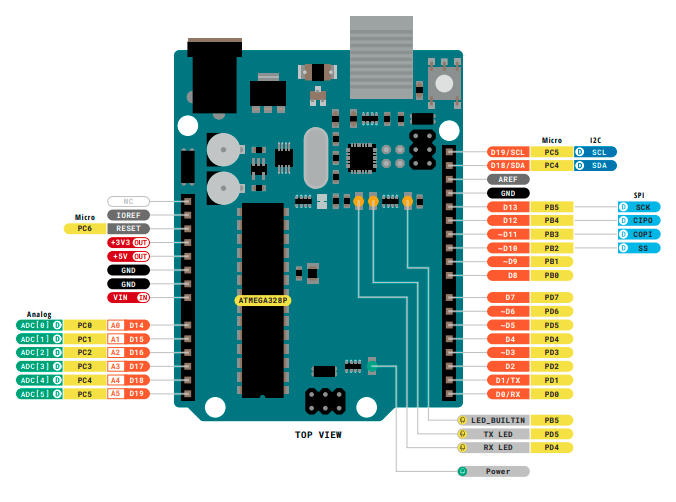
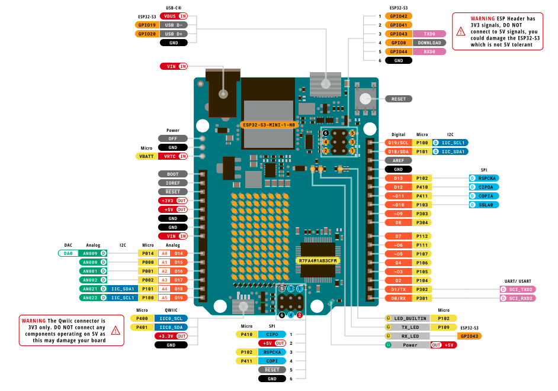
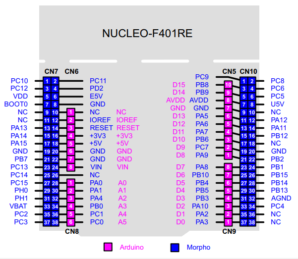

# From Arduino to STM32

Practical notes, examples, and reference material for moving Arduino Uno projects to STM32 microcontrollers.

## What This Project Covers

- Mapping familiar Arduino concepts to STM32 hardware and tooling
- Recreating Arduino projects with STM32CubeIDE, STM32CubeMX, or PlatformIO
- Comparing pins, peripherals, libraries, and programming workflows
- Building small, reproducible examples for both platforms

## Equipment

### Arduino Uno R3

The Arduino Uno R3 is the baseline board for many Arduino tutorials. Its removable ATmega328P is an 8-bit AVR microcontroller, and the board uses `5V` logic. It is the reference point for the lessons in this project: straightforward to use, well documented, and compatible with the familiar Uno shield layout.


### Arduino Uno R4 WiFi

The Arduino Uno R4 WiFi preserves the Uno form factor and `5V` GPIO while substantially increasing processing power and memory. Its Renesas RA4M1 main microcontroller provides modern peripherals such as a DAC, CAN bus, and real-time clock. A separate ESP32-S3 module supplies Wi-Fi and Bluetooth Low Energy connectivity, and the board includes a 12 x 8 LED matrix.


### STM32 Nucleo-F401RE

The STM32 Nucleo-F401RE is an STM32 Nucleo-64 development board based on the STM32F401RE. It provides Arduino Uno R3-compatible connectors for shields as well as ST Morpho male headers that expose more of the microcontroller's pins. The on-board ST-LINK programmer/debugger lets you program and debug the board over USB. Its GPIO is `3.3V` logic, so it must not be connected directly to a `5V` signal from an Uno.

Source: [STMicroelectronics](https://www.st.com/resource/en/user_manual/um1724-stm32-nucleo64-boards-mb1136-stmicroelectronics.pdf) Figure 17

## Board Comparison

| Feature | Arduino Uno R3 | Arduino Uno R4 WiFi | STM32 Nucleo-F401RE |
| --- | --- | --- | --- |
| Main processor | Microchip ATmega328P, 8-bit AVR | Renesas RA4M1, 32-bit Arm Cortex-M4 | STMicroelectronics STM32F401RE, 32-bit Arm Cortex-M4 with FPU |
| Maximum clock speed | 16 MHz | 48 MHz | 84 MHz |
| Flash memory | 32 kB | 256 kB | 512 kB |
| SRAM | 2 kB | 32 kB | 96 kB |
| Non-volatile data memory | 1 kB EEPROM | Data flash available in the RA4M1 | No dedicated EEPROM; use flash emulation when needed |
| Logic voltage | `5V` | `5V` | `3.3V` |
| Digital I/O | 14 pins, 6 PWM-capable | 14 pins, 6 PWM-capable | Up to 50 GPIO pins; Arduino and Morpho headers expose board-specific subsets |
| Analog input | 6 channels, 10-bit ADC | 6 channels, 14-bit ADC | Up to 16 channels, 12-bit ADC |
| Analog output | None | 1 channel, 12-bit DAC | None |
| Connectivity | USB serial; UART, SPI, I2C | USB-C; UART, SPI, I2C, CAN; Wi-Fi and Bluetooth LE via ESP32-S3 | ST-LINK USB virtual COM/debugging; UART, SPI, I2C, CAN, USB OTG |
| Debugging and programming | USB-to-serial bootloader; ICSP | USB bootloader; SWD pads | On-board ST-LINK debugger/programmer |
| On-board user interface | One user LED | 12 x 8 LED matrix, user LED, Qwiic connector | One user LED, user button, reset button |
| Expansion | Arduino Uno R3 shield headers | Arduino Uno R3 shield headers and Qwiic | Arduino Uno R3 headers and ST Morpho male headers |
| Timers | 3 timers: Timer0 (8-bit), Timer1 (16-bit), Timer2 (8-bit) |2 × 32-bit + 6 × 16-bit | 4 general-purpose timers, 2 advanced timers, 2 basic timers |

Specifications are summarised from the [Arduino Uno R3](https://docs.arduino.cc/hardware/uno-rev3/), [Arduino Uno R4 WiFi](https://docs.arduino.cc/hardware/uno-r4-wifi/), and [ST NUCLEO-F401RE](https://www.st.com/en/evaluation-tools/nucleo-f401re.html) documentation. Check the board pinout and MCU datasheet before connecting hardware: connector-accessible pins and alternate functions depend on the board.

## Getting Started

Start with [Lesson 1: Light an LED from 5V](lesson-01-led-5v.md). It introduces the Arduino Uno R3 and Nucleo board power headers without writing firmware. Continue with [Lesson 2: Alternate red and blue LEDs](lesson-02-alternating-leds.md) to control LEDs from GPIO pins, then [Lesson 3: Hardware timer LED control](lesson-03-hardware-timers.md) to replace blocking delays with timer interrupts.

Use the [Acronyms and Dictionary](glossary.md) for short definitions of the terms used throughout these lessons.

For the repository overview, setup information, and current progress, see the [project README](https://github.com/rockonsoft/from_arduino_to_stm32#readme).

## Lessons

1. [Light an LED from 5V](lesson-01-led-5v.md)
2. [Alternate red and blue LEDs](lesson-02-alternating-leds.md)
3. [Hardware timer LED control](lesson-03-hardware-timers.md)

## Reference

- [Acronyms and Dictionary](glossary.md)

## Planned Guides

| Arduino Uno | STM32 equivalent |
| --- | --- |
| `digitalWrite()` | GPIO output |
| `analogRead()` | ADC conversion |
| `Serial` | UART / USART |
| `delay()` | Hardware timer or HAL delay |
| `attachInterrupt()` | External interrupt (EXTI) |

## Repository Layout

Firmware source and examples will be organised by target platform, while this `docs/` directory contains the GitHub Pages documentation.


## Git Tagging
Use tags to mark the start and end of each lesson. For example, after completing Lesson 2, run:
```bash
git tag -a End_Lesson2  <commit> -m"Lesson 2 completed"
git push origin --tags
```
