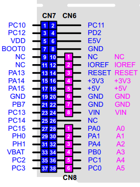
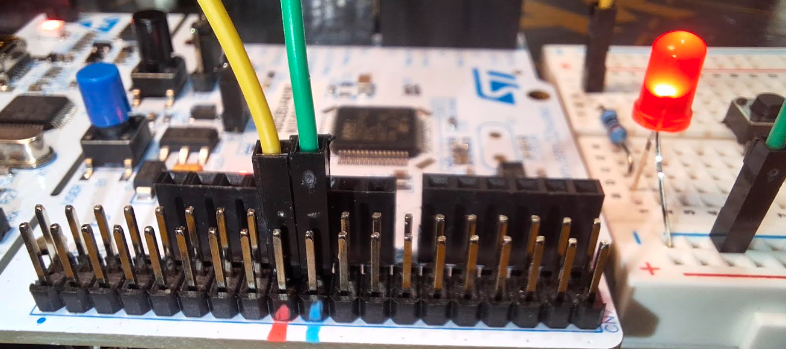

# Lesson 1: Light an LED from 5V

This first hardware exercise lights an external LED from the regulated `5V` output of an Arduino Uno R3 and then from an STM32 Nucleo board. It uses no firmware: the LED is on whenever the board receives USB power.

You will use the Arduino-compatible headers on both boards and, on the Nucleo, also locate the same supply on its male expansion headers.

## Parts

- Arduino Uno R3
- STM32 Nucleo board
- Breadboard and jumper wires
- One LED
- One resistor between `220 ohm` and `1 kohm`
- USB cable for each board

## Safety

- Use one board at a time. Do **not** connect the Arduino's `5V` pin to the Nucleo's `5V` pin.
- Always place a resistor in series with the LED. Connecting an LED directly across `5V` can damage the LED or the board.
- Confirm every pin label against the silkscreen and your Nucleo board's user manual. Nucleo variants have different header locations and pin names.

## The Circuit

An LED has polarity. The longer leg is the **anode** (`+`); the shorter leg, usually beside the flat edge of its body, is the **cathode** (`-`).

```text
5V ---- [220 ohm to 1 kohm resistor] ----|>|---- GND
                                         LED
```

The resistor can be before or after the LED. It limits current to a safe level. With a typical red LED and a `330 ohm` resistor, the current is approximately:

```text
current = (supply voltage - LED voltage drop) / resistance
current = (5 V - 2 V) / 330 ohm
current = 0.009 A, or about 9 mA
```

## Part A: Arduino Uno R3

1. Disconnect the Uno from USB power.
2. Place the LED on the breadboard.
3. Connect the Uno `5V` header pin to one end of the resistor.
4. Connect the other end of the resistor to the LED anode.
5. Connect the LED cathode to any Uno `GND` header pin.
6. Connect the Uno to USB power.

The LED should light immediately. If it does not, disconnect power and reverse the LED, then check the resistor and ground connections.

## Part B: STM32 Nucleo Arduino-Compatible Headers

1. Disconnect the Nucleo from USB power.
2. Reuse the same breadboard circuit, but remove the Uno connections.
3. On the Nucleo's Arduino Uno-compatible headers, connect the pin marked `5V` to the resistor.
4. Connect the LED cathode to a nearby pin marked `GND`.
5. Connect the Nucleo to USB power.

The LED should light. This verifies that the Nucleo provides a `5V` supply through its Arduino-compatible header.

## Part C: STM32 Nucleo Male Expansion Headers

Nucleo boards also expose power pins on their male expansion headers, often called **Morpho headers**. 


1. Disconnect USB power.
2. Find a male expansion-header pin explicitly labelled `5V` and a pin labelled `GND` in your board documentation or on the PCB. 
3. Move the resistor connection from the Arduino-compatible `5V` pin to the labelled male-header `5V` pin.
4. Keep the LED cathode connected to the labelled male-header `GND` pin.
5. Reconnect USB power.

The LED should light again. The Arduino-compatible and male expansion headers distribute the same board power rail, but they are different physical connection points.


## What You Learned

- `5V` and `GND` form a complete power circuit.
- LEDs require correct polarity and a series current-limiting resistor.
- The Arduino Uno R3 and STM32 Nucleo boards make `5V` and `GND` available through headers.
- Some Nucleo signals are available through both Arduino-compatible and male expansion headers.

## Next Step

In the next lesson, the LED can move from a constant `5V` supply to a GPIO pin so firmware controls when it turns on and off.