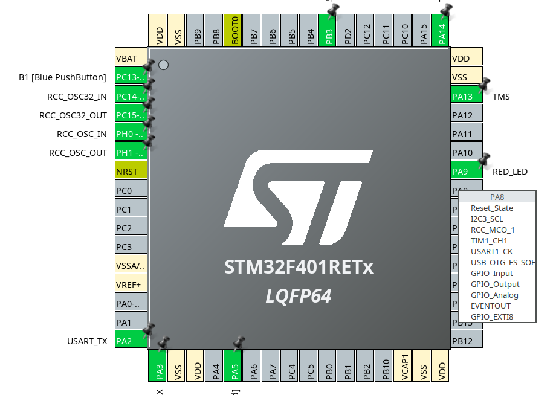
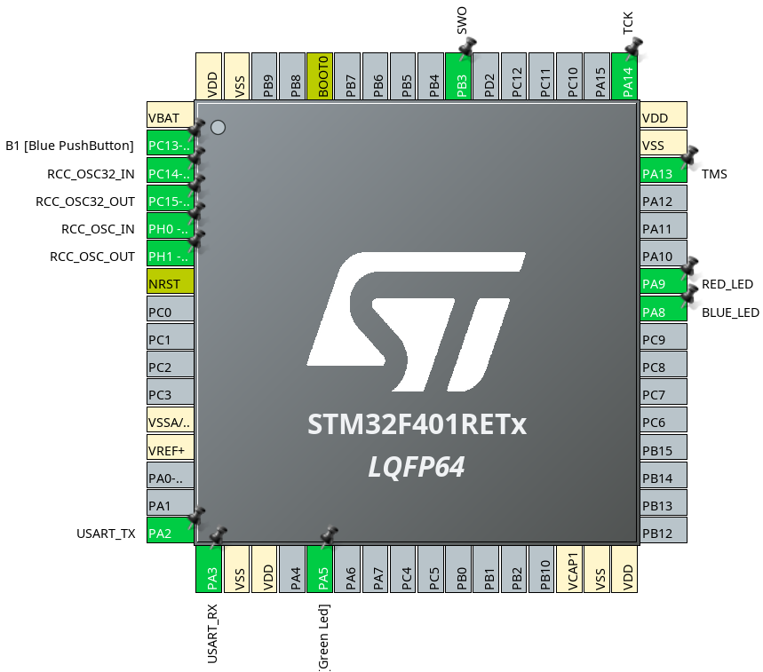
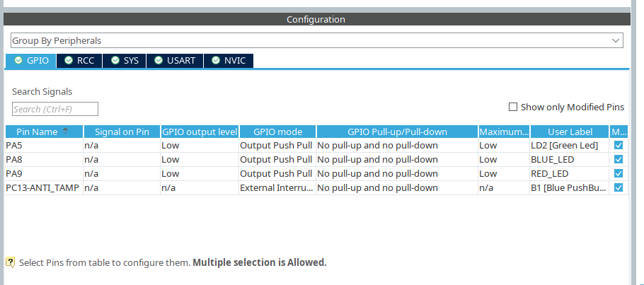
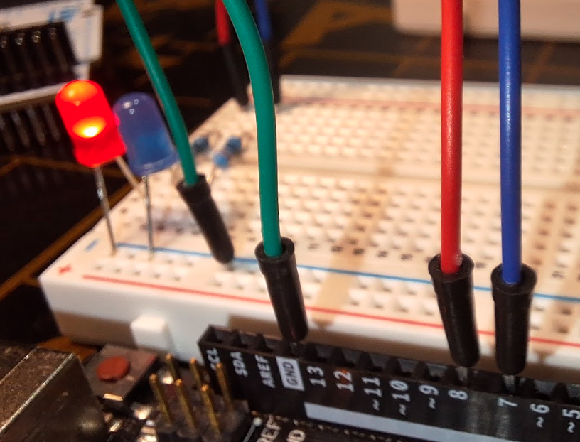
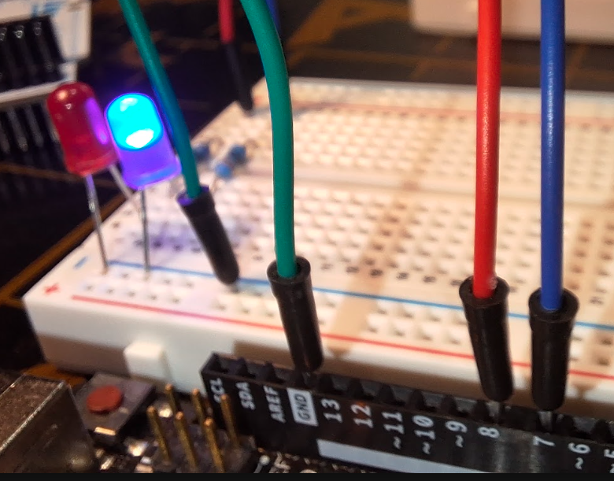
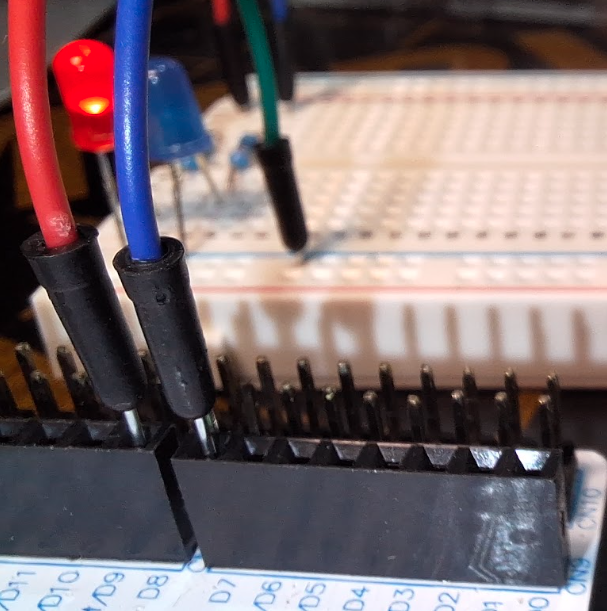
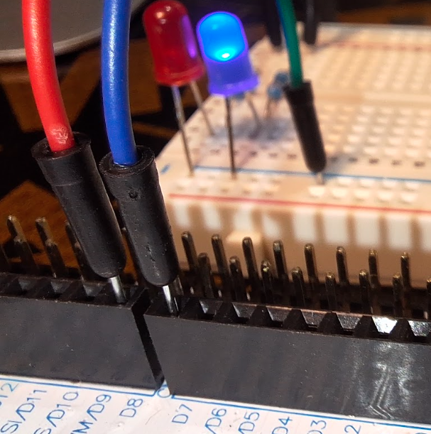

# Lesson 2: Alternate Red and Blue LEDs

This lesson moves the LEDs from the constant `5V` supply used in Lesson 1 to GPIO pins controlled by firmware. A red LED and a blue LED take turns: one is on for `1000 ms` while the other is off, then they swap.

The same Arduino-compatible header positions are used on both boards:

| LED | Arduino Uno R3 | STM32 Nucleo-F401RE |
| --- | --- | --- |
| Red | `D8` | `D8`, mapped to `PA9` |
| Blue | `D7` | `D7`, mapped to `PA8` |

## Parts

- Arduino Uno R3 or STM32 Nucleo-F401RE, powered over USB
- Breadboard and jumper wires
- One red LED and one blue LED
- Two resistors between `220 ohm` and `1 kohm`; `330 ohm` is a good starting value

## Safety

- Use only one board at a time. Do not connect Uno and Nucleo GPIO pins together.
- Each LED needs its own series resistor.
- The Nucleo-F401RE GPIO pins are `3.3V` logic. Do not connect a `5V` output from the Uno directly to a Nucleo GPIO pin.

## Wiring

Connect each LED with its own resistor. The LED anode is the longer leg; the cathode is the shorter leg or the leg next to the flat edge.

```text
D8 / PA9 ---- [330 ohm resistor] ----|>|---- GND
                                      red LED

D7 / PA8 ---- [330 ohm resistor] ----|>|---- GND
                                      blue LED
```

For the Uno, use header pins `D8` and `D7`. For the Nucleo-F401RE, use the Arduino-compatible header pins `D8` and `D7`; their STM32 names are `PA9` and `PA8` respectively. Connect both LED cathodes to a `GND` pin.

## Part A: Arduino Uno R3

1. Disconnect the Uno from USB power and complete the wiring.
2. Connect the Uno to USB and upload this sketch.

```cpp
const int redLedPin = 8;
const int blueLedPin = 7;
const unsigned long intervalMs = 1000;

void setup() {
  pinMode(redLedPin, OUTPUT);
  pinMode(blueLedPin, OUTPUT);
}

void loop() {
  digitalWrite(redLedPin, HIGH);
  digitalWrite(blueLedPin, LOW);
  delay(intervalMs);

  digitalWrite(redLedPin, LOW);
  digitalWrite(blueLedPin, HIGH);
  delay(intervalMs);
}
```

The red LED lights for one second while the blue LED is off. The blue LED then lights for one second while the red LED is off. This repeats continuously.

## Part B: STM32 Nucleo-F401RE

### Configure the pins

In STM32CubeMX or STM32CubeIDE's `.ioc` editor:

1. Set `PA9` to `GPIO_Output` and label it `RED_LED`.
2. Set `PA8` to `GPIO_Output` and label it `BLUE_LED`.  
3. Set both outputs to `Low` initially, with push-pull output mode and no pull resistor.

4. Generate the project code and build it for the Nucleo-F401RE.

### Add the alternating loop

Place this code in the generated `while (1)` loop in `main.c`. CubeMX generates the `RED_LED_Pin`, `RED_LED_GPIO_Port`, `BLUE_LED_Pin`, and `BLUE_LED_GPIO_Port` names after you assign the labels above.

```c
HAL_GPIO_WritePin(RED_LED_GPIO_Port, RED_LED_Pin, GPIO_PIN_SET);
HAL_GPIO_WritePin(BLUE_LED_GPIO_Port, BLUE_LED_Pin, GPIO_PIN_RESET);
HAL_Delay(1000);

HAL_GPIO_WritePin(RED_LED_GPIO_Port, RED_LED_Pin, GPIO_PIN_RESET);
HAL_GPIO_WritePin(BLUE_LED_GPIO_Port, BLUE_LED_Pin, GPIO_PIN_SET);
HAL_Delay(1000);
```

Build and run the program through the Nucleo's on-board ST-LINK debugger. The LEDs alternate in the same one-second pattern as the Uno.






## Arduino to STM32 Mapping

| Arduino Uno R3 | STM32 Nucleo-F401RE |
| --- | --- |
| `D8` | `PA9` via Arduino header `D8` |
| `D7` | `PA8` via Arduino header `D7` |
| `pinMode(pin, OUTPUT)` | Configure the pin as `GPIO_Output` in CubeMX |
| `digitalWrite(pin, HIGH)` | `HAL_GPIO_WritePin(..., GPIO_PIN_SET)` |
| `digitalWrite(pin, LOW)` | `HAL_GPIO_WritePin(..., GPIO_PIN_RESET)` |
| `delay(1000)` | `HAL_Delay(1000)` |

## What You Learned

- A GPIO pin can source current to control an LED when configured as an output.
- Each LED needs its own current-limiting resistor and a connection to GND.
- Arduino `D8` and `D7` correspond to Nucleo-F401RE pins `PA9` and `PA8` on the Arduino-compatible headers.
- `digitalWrite()` and `HAL_GPIO_WritePin()` both control a logic output, while `delay()` and `HAL_Delay()` pause the program between state changes.

## Troubleshooting

- If neither LED lights, check both GND connections and confirm the firmware was uploaded.
- If an LED does not light, disconnect power and reverse that LED.
- If both LEDs light together, confirm the two resistor inputs go to separate pins and the code writes one pin low before the delay.
- If the Nucleo LED behavior is reversed, verify that `PA9` is connected to the red LED and `PA8` to the blue LED.

## Next Step

The next lesson can replace the blocking delays with a hardware timer or a non-blocking timing loop.