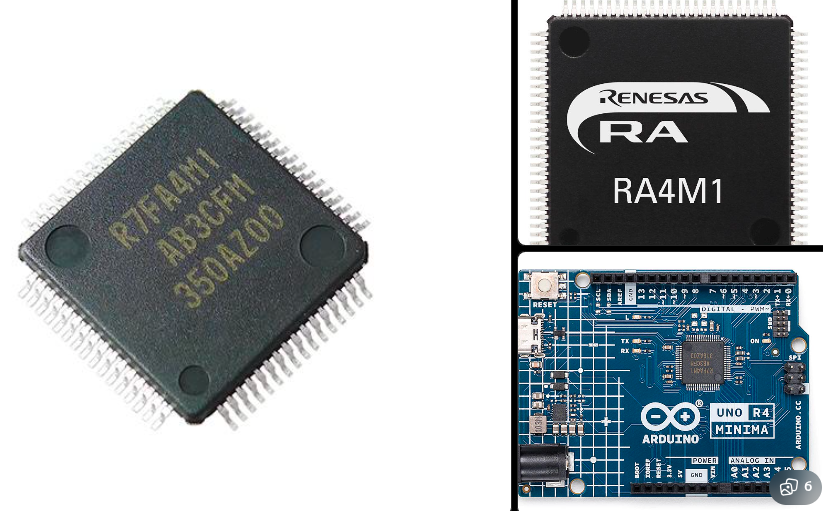

# Lesson 3: Hardware Timer LED Control

Lesson 2 used `delay()` and `HAL_Delay()` to alternate two LEDs. Those functions stop the main program while waiting. In this lesson, a hardware timer creates a one-second event independently of the main loop. The loop can perform other work while the timer measures time.

The red and blue LED wiring remains the same as Lesson 2:

| LED | Arduino Uno R3 and Uno R4 WiFi | STM32 Nucleo-F401RE |
| --- | --- | --- |
| Red | `D8` | `D8`, mapped to `PA9` |
| Blue | `D7` | `D7`, mapped to `PA8` |

## Timer Pattern

All three implementations use the same pattern:

1. Configure a hardware timer to generate an update every second.
2. In the timer interrupt callback, set a `volatile` flag only.
3. In the main loop, check and clear the flag, then swap the LED states.

Do not call slow functions such as `delay()`, `Serial.print()`, or network code inside a timer interrupt. The interrupt should finish quickly.

## Part A: Arduino Uno R3 Timer1 CTC

For this lesson I will not be using the Arduino IDE, but will be using the Arduino CLI to compile and upload the sketch. Details on the Arduino CLI can be found [here](https://docs.arduino.cc/arduino-cli/). The sketch is located in the `3_hard_time/arduino/uno-r3-ctc` directory.

### Using the Arduino CLI
1. Install the Arduino CLI and add it to your system path.
2. Open a terminal and navigate to the `3_hard_time/arduino/` directory (The parent directory of the sketch you want to compile).
3. Install the Arduino AVR core if you haven't already:
```bash
arduino-cli core update-index
arduino-cli core install arduino:avr
```
4. Compile the sketch:
```bash
arduino-cli compile -b arduino:avr:uno uno-r3-ctc
```
(Where does the compiled output go? You can also specify a different build path using the `--build-path` option, by default it goes to a temporary directory.TBC???)
5. Find the port your Arduino Uno R3 is connected to. On Linux, you can use:
```bash
arduino-cli board list
```
This produces output like:
```text
Port         Protocol Type              Board Name  FQBN            Core
/dev/ttyACM0 serial   Serial Port (USB) Arduino UNO arduino:avr:uno arduino:avr
``` 
6. Upload the sketch to your Arduino Uno R3:
```bash
arduino-cli upload -p <your_port> --fqbn arduino:avr:uno uno-r3-ctc
```
If successful, this will output something like:
```text 
New upload port: /dev/ttyACM0 (serial)
```


The Uno R3 uses the ATmega328P. Its 16-bit `Timer1` can run in **CTC** (Clear Timer on Compare Match) mode. In CTC mode, the counter resets automatically when it reaches the value in the `OCR1A` compare register.

At a `16 MHz` CPU clock, dividing by `1024` gives a timer clock of `15,625 Hz`. Setting `OCR1A` to `15,624` produces one compare event each second:

```text
16,000,000 Hz / 1024 = 15,625 Hz
15,625 timer counts = 1 second
OCR1A = 15,625 - 1 = 15,624
```

Once [uno-r3-ctc.ino](../3_hard_time/arduino/uno-r3-ctc/uno-r3-ctc.ino) is uploaded, the red and blue LEDs alternate every second without blocking the main loop. The Uno R3 sketch uses the `ISR(TIMER1_COMPA_vect)` interrupt vector to set a `volatile` flag, which the main loop checks to toggle the LEDs.

Question: How many timers can the ATmega328P run at the same time? The ATmega328P has three timers: `Timer0` (8-bit), `Timer1` (16-bit), and `Timer2` (8-bit). Each timer can be configured independently, allowing multiple timers to run simultaneously.

## Part B: Arduino Uno R4 WiFi FspTimer

The Uno R4 WiFi uses the Renesas RA4M1. Its Arduino core provides `FspTimer`, which selects an available GPT or AGT hardware timer channel and configures it for periodic interrupts. This is board-specific Arduino code: it does not compile for the Uno R3.

### Using the Arduino CLI
1. List the available boards and install the Uno R4 WiFi core if you haven't already:
```bash
arduino-cli board list
```
This should produce output like:
```text
Port         Protocol Type              Board Name          FQBN                          Core
/dev/ttyACM0 serial   Serial Port (USB) Arduino UNO R4 WiFi arduino:renesas_uno:unor4wifi arduino:renesas_uno
```

```bash
arduino-cli core update-index
arduino-cli core install arduino:renesas_uno
```
2. Compile the sketch:
```bash
arduino-cli compile -b arduino:renesas_uno:unor4wifi uno-r4-fsptimer
``` 
3. Upload the sketch to your Uno R4 WiFi:
```bash
arduino-cli upload -p <your_port> --fqbn arduino:renesas_uno:unor4wifi uno-r4-fsptimer
``` 

After uploading, the sketch requests a free timer channel and configures a `1 Hz` periodic event.

My specific Uno R4 WiFi board has the R7FA4M1AB3CFM chip on it from the Renesas RA4M1 family. 
Question: How many timers can the R7FA4M1AB3CFM run at the same time? The R7FA4M1AB3CFM has multiple GPT and AGT timers, allowing several timers to run concurrently. According to the [datasheet](https://www.renesas.com/en/products/ra4m1/part-details/r7fa4m1ab3cfm-aa0) the following timers are available as shown in this table:

| Timer Type | Number of Timers | Description |
| --- | --- | --- |
| GPT 32-Bit | 2 | General Purpose Timers, 32-bit |
| GPT 16-Bit | 6 | General Purpose Timers, 16-bit |
| AGT | 2 | Asynchronous General Purpose Timer / Interval Timer (channels) |
| Watchdog Timer | 2 | Watchdog timers |

No 8-bit timers are available on the R7FA4M1AB3CFM.


## Part C: STM32 Nucleo-F401RE TIM2

The Nucleo-F401RE uses an STM32F401RE. Configure `TIM2` in STM32CubeMX as an internal-clock **Time Base** with **Update interrupt** enabled.

The existing project clock configuration runs the APB1 timer clock at `84 MHz`. These values produce a one-second update:

```text
timer clock = 84,000,000 Hz
prescaler = 8,400 - 1  -> 10,000 Hz counter clock
period = 10,000 - 1    -> 1 second update event
```

In the CubeMX timer configuration:

1. Enable `TIM2` as **Time Base** with **Internal Clock** source.
2. Set **Prescaler** to `8399` and **Counter Period** to `9999`.
3. Enable the `TIM2 global interrupt` in the NVIC configuration.
4. Keep `PA9` (`RED_LED`) and `PA8` (`BLUE_LED`) as GPIO outputs from Lesson 2.
5. Generate the project code.

Add a timer handle and a flag in the user-code sections of `main.c`:

```c
TIM_HandleTypeDef htim2;
volatile uint8_t timerTick = 0;
```

Call `MX_TIM2_Init()` with the other `MX_..._Init()` functions, then start the interrupt timer after initialization:

```c
HAL_TIM_Base_Start_IT(&htim2);
```

Implement the callback in a user-code section:

```c
void HAL_TIM_PeriodElapsedCallback(TIM_HandleTypeDef *htim)
{
  if (htim->Instance == TIM2) {
    timerTick = 1;
  }
}
```

Replace the blocking LED code in `while (1)` with:

```c
if (timerTick) {
  timerTick = 0;
  HAL_GPIO_TogglePin(RED_LED_GPIO_Port, RED_LED_Pin);
  HAL_GPIO_TogglePin(BLUE_LED_GPIO_Port, BLUE_LED_Pin);
}

/* Other application work runs here without a one-second delay. */
```

## Comparison

| Board | Timer implementation | One-second source | Interrupt entry point |
| --- | --- | --- | --- |
| Uno R3 | ATmega328P Timer1 in CTC mode | `OCR1A = 15624`, prescaler `1024` | `ISR(TIMER1_COMPA_vect)` |
| Uno R4 WiFi | RA4M1 GPT or AGT via `FspTimer` | `1.0f` Hz periodic timer | `timerCallback()` |
| Nucleo-F401RE | STM32F401RE TIM2 time base | Prescaler `8399`, period `9999` | `HAL_TIM_PeriodElapsedCallback()` |

## What You Learned

- Hardware timers create periodic events without blocking the main loop.
- CTC mode on the Uno R3 clears the Timer1 counter after each compare match.
- `FspTimer` manages RA4M1 timer allocation on the Uno R4 WiFi.
- CubeMX can configure STM32 timer peripherals and generate interrupt setup code.
- A `volatile` flag moves substantive work out of the timer interrupt and into the main loop.